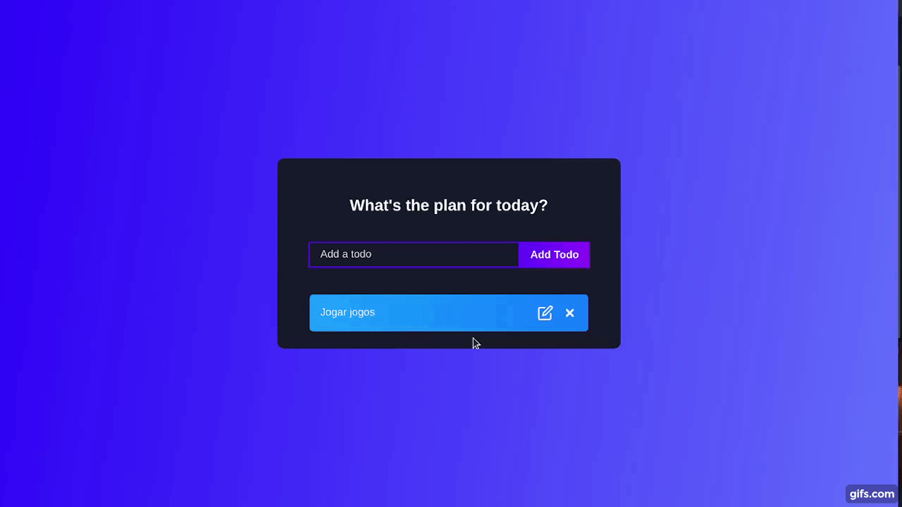

# To-do List Colorfull

## Preview

<h1 align="center">
  
</h1>

## 💻 Project

Este projeto foi desenvolvido com o objetivo de aplicar conceitos básicos do NextJS e utilização do Chakra-ui.
<br />

## 🧬 Techologies

This project was developed using the following technologies:
 
- [NextJS](https://nextjs.org/)
- [Chakra-ui](https://chakra-ui.com/)
- [Typescript](https://www.typescriptlang.org/)


## 🚀 Getting Started 

Clone the project and access the folder.
```bash
#Clone project
$ git clone https://github.com/evertonfxavier/todoList-colorfull.git
```

Follow the steps below
```bash
#Install the dependecies 
$ npm install or yarn  
 
#Start projet
$ npm run dev or yarn dev
```

## 📝 License

This project is licensed under the MIT License. See the [LICENSE](https://github.com/evertonfxavier/todoList-colorfull/blob/main/LICENSE.md) file for details
